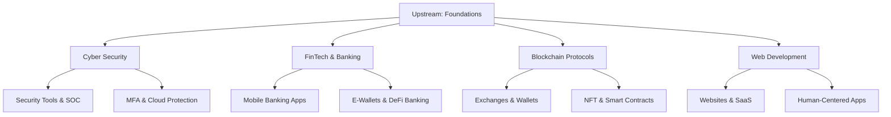

# 🌍 Digital-Genesis: Mapping the Future of IT Ecosystems

[](https://github.com/kongali1720)
[](#)
[](#)
[](#)
[](#)
[](LICENSE)

---

## 📖 Introduction

**Digital-Genesis** is a visionary framework mapping the **entire IT ecosystem**, from core upstream technologies to downstream human-centered applications.  
It serves as the **genesis document** for modern IT, spanning Cyber Security, FinTech & Banking, Blockchain, and Web Development.

This repository is designed for:
- Developers & researchers to understand ecosystem layers  
- Companies & entrepreneurs to align upstream & downstream strategies  
- Humanity-centered projects like **Down Syndrome empowerment**  

---

## 🌌 Vision & Mission

### 🚀 Vision
To create a **comprehensive IT atlas** that bridges core systems with human-centered applications, empowering innovation while keeping humanity at the center.

### 🎯 Mission
1. Map IT ecosystems across industries.  
2. Bridge upstream & downstream layers of technology.  
3. Provide educational resources for developers, researchers, and entrepreneurs.  
4. Highlight humanitarian impact via technology.

---

## 🏗️ Ecosystem Layers

- **Upstream (Core Foundations / Hulu)** → Infrastructure, protocols, algorithms, security models.  
- **Downstream (Applications / Hilir)** → End-user products, financial solutions, and human-centered applications.

---

## 📊 Ecosystem Mapping Table

| Domain                | Upstream (Core Foundations)                                    | Downstream (Real-World Impact)                                      |
|------------------------|---------------------------------------------------------------|----------------------------------------------------------------------|
| **Cyber Security**     | Encryption, PKI, Zero Trust, HSM, Secure Protocols            | SOC services, MFA apps, Endpoint security, Cloud protection         |
| **FinTech / Banking**  | Core banking, SWIFT, ISO 20022, API gateways                  | Mobile banking apps, digital wallets, DeFi banking                  |
| **Blockchain**         | Protocol development, consensus algorithms, Layer-1 networks  | Exchanges, wallets, DeFi apps, NFT ecosystems                       |
| **Web Development**    | Programming languages, frameworks, cloud infra, hosting       | Websites, SaaS, CMS, interactive platforms                          |

---

## 🔗 Ecosystem Flow Diagram



## 🧩 Use Cases

- **Education:**  
  Explain IT upstream & downstream to students and researchers.  

- **Development:**  
  Help developers understand ecosystem layers.  

- **Business:**  
  Align companies with upstream providers or downstream markets.  

- **Humanitarian Impact:**  
  Support causes like **Down Syndrome awareness**.

---

## 🌐 Key Focus Areas

### 🛡️ Cyber Security
- PKI & Zero Trust  
- Firewalls & Intrusion Prevention  
- Cloud Security  

### 💳 FinTech & Banking
- Core Banking Infrastructure  
- Mobile Apps & Digital Wallets  
- Open Banking & APIs  

### ⛓️ Blockchain
- Consensus Algorithms & Protocols  
- Layer-1 & Layer-2 Networks  
- NFTs & DeFi Ecosystems  

### 🌐 Web Development
- Programming Languages & Frameworks  
- Cloud & Hosting Infrastructure  
- Interactive & Human-Centered Platforms  

---

## 2️⃣ Struktur Folder Profesional
```bash
Digital-Genesis/
│
├── README.md
├── LICENSE
├── CONTRIBUTING.md
├── SECURITY.md
├── CODE_OF_CONDUCT.md
├── CHANGELOG.md
├── .gitignore
└── docs/
├── diagrams/ # Mermaid or PNG/SVG diagrams
└── resources/ # Reference materials, PDFs, etc.
```


<h3 align="center" style="color:#39ff14; font-size:1.5rem;">
💡 ☕ Traktir Kopi & Nasi Padang / Nasi Gorengnya ya cuy! 😄
</h3>

<div align="center">

<p style="color:#ffffff; font-size:1.1rem;">
Dukung terus biar semangat bikin karya edukatif lainnya...  
Keep supporting so I stay motivated to create more educational works!
</p>

<a href="https://www.paypal.com/paypalme/bungtempong99" target="_blank" style="text-decoration:none;">
  
</a>

<p style="color:#39ff14; font-size:1rem; margin-top:8px;">
Support with ☕ so I can buy 🍜 and keep being 🧠!
</p>

</div>

---

<h2 align="center" style="color:#39ff14;">📫 Let’s Connect together</h2>

<p align="center">
  <a href="https://github.com/kongali1720" target="_blank">
    
  </a>
  <a href="mailto:admin@kongali1720.com">
    
  </a>
  <a href="https://discord.gg/dXM88zFU" target="_blank">
    
  </a>
  <a href="https://www.instagram.com/kongali1720/" target="_blank">
    
  </a>
</p>

<p align="center">
  <a href="https://x.com/Kongali1720" target="_blank">
    
  </a>
  <a href="https://younext.cloud" target="_blank">
    
  </a>
  <a href="https://kongali1720.com" target="_blank">
    
  </a>
  <a href="https://wa.me/447440014278" target="_blank">
    
  </a>
</p>

<h3 align="center" style="color:#ff69b4;">❤️ 💻 INITIATING HUMANITY MODE... for Down Syndrome ❤️</h3>

<div align="center">

<table style="margin: 0 auto; border-collapse: collapse; box-shadow: 0 4px 10px rgba(0,0,0,0.2); border-radius: 8px; overflow: hidden;">
  <thead style="background-color:#ff69b4; color:white;">
    <tr>
      <th style="padding: 12px 25px; font-size: 18px;">Item</th>
      <th style="padding: 12px 25px; font-size: 18px;">Keterangan / Description</th>
    </tr>
  </thead>
  <tbody style="background-color:#1a1a1a; color:#39ff14;">
    <tr>
      <td style="padding: 12px 25px;">🎯 Target</td>
      <td style="padding: 12px 25px;">Anak-anak Pejuang Down Syndrome / Kids with Down Syndrome</td>
    </tr>
    <tr>
      <td style="padding: 12px 25px;">📡 Status</td>
      <td style="padding: 12px 25px;">Butuh Dukungan / Needs Support</td>
    </tr>
    <tr>
      <td style="padding: 12px 25px;">🧠 Response</td>
      <td style="padding: 12px 25px;">Buka Hati + Klik Link = Satu Senyum Baru / Open Heart + Click Link = One New Smile</td>
    </tr>
  </tbody>
</table>

<p align="center" style="margin-top:15px; color:white; font-size:1rem;">
Mereka bukan berbeda — mereka dilahirkan untuk mengajarkan dunia tentang cinta yang murni dan kesabaran yang luar biasa.<br>
They are not different — they were born to teach the world pure love and extraordinary patience.
</p>

<p align="center" style="margin-top: 15px;">
  <a href="https://mydonation4ds.github.io/" target="_blank" style="display: inline-block; text-decoration:none;">
    
  </a>
</p>

---

<section align="center" style="font-family: Arial, sans-serif;">

<h2 style="margin-bottom: 15px; color: #0070f3;">💳 Dukungan Pembayaran</h2>

<table align="center" style="margin: 0 auto; border-collapse: collapse; border-radius: 8px; overflow: hidden;">
  <thead style="background-color: #0070f3; color: white;">
    <tr>
      <th style="padding: 10px 20px; font-size: 16px;">Visa</th>
      <th style="padding: 10px 20px; font-size: 16px;">Mastercard</th>
      <th style="padding: 10px 20px; font-size: 16px;">PayPal</th>
    </tr>
  </thead>
  <tbody style="background-color: #f9f9f9;">
    <tr>
      <td style="padding: 10px;">
        
      </td>
      <td style="padding: 10px;">
        
      </td>
      <td style="padding: 10px;">
        
      </td>
    </tr>
  </tbody>
</table>

</section>

---

<p align="center" style="margin-top: 15px;">
  Kalau project ini bantu kamu, jangan lupa kasih bintang ⭐ dan share ke teman-teman!<br>
  Follow <a href="https://twitter.com/kongali1720" target="_blank">@kongali1720</a> untuk diskusi & update seru 🔥
</p>

<p align="center" style="margin-top: 10px;">
  <a href="https://twitter.com/kongali1720" target="_blank">
    
  </a>
</p>

---

### 👨‍💻 Author  

[](https://github.com/kongali1720)  
[](#)  

 *“Every code, every system, every block — is part of my life.”*  


## 📫 Connect with Me

<p align="center">
  <a href="https://kongali1720.com" target="_blank">
    
  </a>
  <a href="https://github.com/kongali1720" target="_blank">
    
  </a>
<a href="https://www.youtube.com/@kongali1720" target="_blank">
  
</a>
  <a href="mailto:admin@kongali1720.com">
    
  </a>
  <a href="https://wa.me/447440014278" target="_blank">
    
  </a>
</p>


